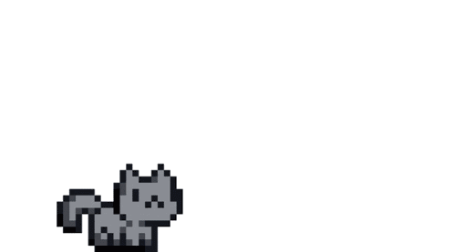

<h1 align="center"><code>hi, i'm nadhif.</code></h1>

  <code>cs student · ui/ux · creative things</code>

 

strong interest in ui/ux and web development. enjoy turning ideas into simple and useful digital experiences with learning, building, and exploring things around design and technology. also working on becoming better at both the creative and technical side of what i do.

## projects

working on digital products, web projects, and visual designs. most of my projects are little experiments where i get to learn something new.

## find me

<pre>
portfolio : under-constructions
linkedin  : <a href="https://www.linkedin.com/in/nadhi-fa/">linkedin.com/in/nadhi-fa</a>
</pre>

 

  

  <code>thanks for stopping by.</code>

